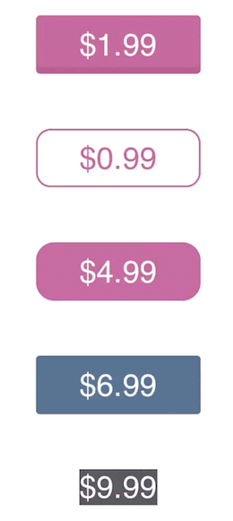
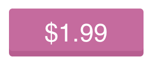
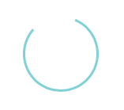

# InAppPurchaseButton

A simple and customisable in-app purchase button, written in Swift.

[](https://swift.org/)
[](https://cocoapods.org/pods/InAppPurchaseButton)
[](https://github.com/Carthage/Carthage)
[](http://cocoadocs.org/docsets/InAppPurchaseButton)
[](https://github.com/PGSSoft/InAppPurchaseButton)



## Installation

The most convenient way to install it is by using [Cocoapods](https://cocoapods.org/) with Podfile:

```ruby
pod 'InAppPurchaseButton'
```

or using [Carthage](https://github.com/Carthage/Carthage) and add a line to `Cartfile`:

```
github "PGSSoft/InAppPurchaseButton"
```

## Requirements

iOS 8.4

## Usage

```swift
import InAppPurchaseButton
```

##### Adding control

Open your storyboard or xib and drag and drop `UIButton` control.
Change custom class to `InAppPurchaseButton`.

##### Adding constraints

Add constrains, but bear in mind that `InAppPurchaseButton` changes *intrinsic content size* by itself, so adding constrains like height or width will cause unexpected behaviour. 
If you want to control size of `InAppPurchaseButton`, take a look at `minExpandedSize` and `prefferedTitleMargins` properties.

##### Available states

`InAppPurchaseButton` might have following states:

- `regular` (*active* for purchased item or *inactive* for not purchased item) - use it to display text like **Open** (active) or **Buy** (for inactive)




Example:
```swift
button.buttonState = .regular(animate: true, intermediateState: .active)
```

- `busy` - intermediate state between `regular` and `downloading`, usually used when application is waiting for something (e.g. response from the server)



Example:
```swift
button.buttonState = .busy(animate: true)
```

- `downloading` - showing current progress


Example
```swift
button.buttonState = .downloading(progress: 0.25)
```

##### Configurable properties:
- `minExpandedSize` - minimum size for expanded state
- `prefferedTitleMargins` - preferred space between text and edges
- `borderColorForInactiveState` - border color for inactive state
- `borderColorForActiveState` - border color for active state
- `backgroundColorForInactiveState` - fill color of the button in inactive state
- `backgroundColorForActiveState` - fill color of the button in active state
- `imageForInactiveState` - stretchable background image of the button in inactive state
- `imageForActiveState` - stretchable background image of the button in active state
- `widthForBusyView` - diameter of the button in case when indicator view is shown
- `cornerRadiusForExpandedBorder` - corner radius of the border during transition from .regular to .busy state
- `borderWidthForBusyView` - border width for .busy state
- `borderWidthForProgressView` - border width for .downloading state
- `ringColorForProgressView` - color of the ring for .downloading state
- `attributedTextForProgressView` - attributed string for .downloading state
- `indicatorImageForProgressMode` - alternatively it is possible to display image for .downloading state
- `transitionAnimationDuration` - the speed for all transition animations
- `shouldAlwaysDisplayBorder` - indicates whether border for .active or .inactive should be visible all the time or only during transition (false by default)
- `attributedTextForInactiveState` - attributed string for .inactive state
- `attributedTextForActiveState` attributed string for .active state

For more information, please check ```InAppPurchaseButton.swift``` documentation and examples

## Contributing

Bug reports and pull requests are welcome on GitHub at [https://github.com/PGSSoft/InAppPurchaseButton](https://github.com/PGSSoft/InAppPurchaseButton).

## License

The project is available as open source under the terms of the [MIT License](http://opensource.org/licenses/MIT).

## About

The project maintained by [software development agency](https://www.pgs-soft.com/) [PGS Software](https://www.pgs-soft.com/).
See our other [open-source projects](https://github.com/PGSSoft) or [contact us](https://www.pgs-soft.com/contact-us/) to develop your product.

## Follow us

[](https://twitter.com/intent/tweet?text=https://github.com/PGSSoft/InAppPurchaseButton)  
[](https://twitter.com/pgssoftware)

